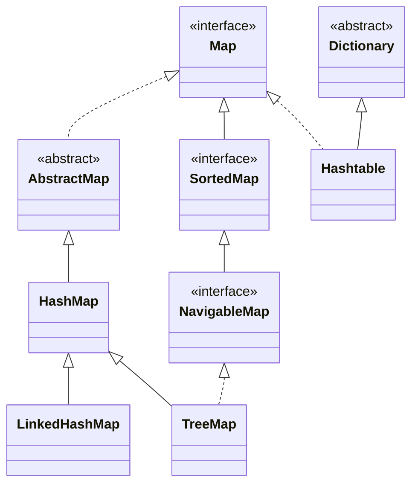

# 基本使用

```java
        Map<String, String> map = new HashMap<>();
        map.put("name", "cloudylc");
        String name = map.get("name");
        System.out.println(name);
```

# Map的族谱




# 底层结构

在jdk1.8中，HashMap的底层结构，主要由 数组+链表/红黑树 构成。

首先HashMap内部维护了一个泛型的**Node数组**，数组内每一个槽都称之为**桶**，数组具有以下几个性质：

- 数组的长度总是$2^n$

- **默认长度**为 `DEFAULT_INITIAL_CAPACITY(16)` 
- 扩容长度按照 **1倍**增容

```java
transient Node<K,V>[] table;
```


当发生**哈希冲突**时，jdk1.8会先采用**链地址法**来解决，将冲突的节点通过**尾插法**加入链表，**链表**由`Node.next `**指针**实现

```java
static class Node<K,V> implements Map.Entry<K,V> {
    final int hash;
    final K key;
    V value;
    Node<K,V> next;
}
```


在当个桶内的链表长度一直增长时，如不干预，对该桶的操作就会退化成O(n)，性能会受到影响。

为解决此问题，在一定条件下该桶内链表则会升级成**红黑树**，树化通过TreeNode对Node的继承使用**多态**实现

树化的条件如下，两者需要同时满足：

1. 单个桶内链表长度 >= `TREEIFY_THRESHOLD(8)` 
2. Node数组长度 >= `MIN_TREEIFY_CAPACITY(64)`

```java
static final class HashMap.TreeNode<K,V> extends LinkedHashMap.Entry<K,V> {
    TreeNode<K,V> parent;  // red-black tree links
    TreeNode<K,V> left;
    TreeNode<K,V> right;
    TreeNode<K,V> prev;    // needed to unlink next upon deletion
    boolean red;
}

static class LinkedHashMap.Entry<K,V> extends HashMap.Node<K,V> {
    Entry<K,V> before, after;
    Entry(int hash, K key, V value, Node<K,V> next) {
        super(hash, key, value, next);
    }
}
```


# 索引定位的设计解析

在未了解到HashMap源码实现前，仅凭对Hash结构的了解，作者第一印象索引定位算法如下：

```java
int index = key.hashCode() % n;
```

其中 n 就是 Node[] 的长度，通过对 key 的 hash 值对其取余，则能在 n 的范围内，定位到数组索引的位置


但在解析了源码后发现，事情并没有这么简单, HashMap底层的索引定位算法如下：

```java
int hash = hash(key);
int index = (n - 1) & hash;
```


与上述算法相比，有三处明显的不同：

1. 索引定位的计算没有用取余 `%` 而是用了 `&`
2. 参与索引定位的hash值额外经过hash()扰动函数


## 位与代替取余

针对第一点可能不太好理解，但是再加上一个前提：**Node[] 的长度始终是2的n次幂**

在该前提下，对于数学上的 hash % n 效果，使用位移方式 hash & ( n - 1)  可等价实现

原因也很简单：

- n = $2^k$时， **n - 1 的二进制低 k 位全是1**。比如：n = 16 (10000b)，n - 1 = 15 (01111b)

- hash & (n - 1)  **就是取 hash 的低 k 位**，也就是 hash 对 $2^k$取模的结果

  

除了效果等价外，位运算`&`相较于取余`%`在**性能**上会更有优势

- 前者是简单的位运算，一条指令即可，速度极快
- 后者需要用到整除单元，延迟明显更高


## 扰动函数

为什么要进行二次hash处理，使得hash值得到充分扰动？

因为根据上述的分析可知，对于 (n - 1) & hash，**结果就取决于 hash 的低位**。

所以 hash 的低位特别重要，假设直接使用 hash = key.hashCode()，如果hash值质量低，存在着较高的哈希碰撞风险。

HashMap 1.8 中的扰动源码如下：

```java static final int hash(Object key) {
static final int hash(Object key) {
    int h;
    return (key == null) ? 0 : (h = key.hashCode()) ^ (h >>> 16);
}
```

扰动函数的结果，就是对 key.hashCode() 进行扰动处理，使期更加的散列，以减少哈希碰撞。

并且对于 key = null 的特殊情况，给出一个相同的结果 0 值，使得 key = null 都定位在同一个槽中。

而扰动和核心就是 **key.hashCode()  ^  (key.hashCode() >>> 16)**

即将 hashCode() 的 高16位移动到低位，将高位信息拉到低位，然后与原 hashCode() 进行异或计算。

最终得出一个低位更具随机性的 hashCode，从而使得索引定位更加均匀，哈希碰撞概率更低！


# put 流程

简易的源码如下，可以看到，`put()`底层是调用了一个参数更加详细的`putVal()`方法

```java
    public V put(K key, V value) {
        return putVal(hash(key), key, value, false, true);
    }

    final V putVal(int hash, K key, V value, boolean onlyIfAbsent, boolean evict) {
      //...
    }
```


## 简易流程

1. 计算 key 的扰动后 hash 值
2. 表空则初始化
3. 索引定位，判断有无发生哈希冲突
   1. 无冲突，则在槽为上新增节点
   2. 有冲突，判断节点类型
      1. 节点是红黑树节点，则添加红黑树节点
      2. 节点是链表，则遍历尾插，再判断当前链表是否需要树化
4. 若存在相同节点，则覆盖值
5. 更新计数器
6. 检查是否需要扩容


## put源码与注释

```java
final V putVal(int hash, K key, V value, boolean onlyIfAbsent, boolean evict) {
    // tab 为临时 table
    Node<K,V>[] tab;
    // p 是当前槽位的头结点
    Node<K,V> p;

    // n 为table的长度，i 为槽位索引
    int n, i;

    // 步骤1：表为空或长度为0，则进行初始化
    if ((tab = table) == null || (n = tab.length) == 0)
        n = (tab = resize()).length;

    // 步骤2：计算出key在table中的位置，如果table[i]为空，则创建一个Node
    if ((p = tab[i = (n - 1) & hash]) == null)
        tab[i] = newNode(hash, key, value, null);

    else {
        // 步骤3：发生了哈希冲突，处理已经存在的节点
        Node<K,V> e; K k;

        // 情况3.1 第一个节点 key 相同，e、k赋原值
        if (p.hash == hash &&
            ((k = p.key) == key || (key != null && key.equals(k))))
            e = p;

        // 情况3.2 节点是红黑树节点
        else if (p instanceof TreeNode)
            e = ((TreeNode<K,V>)p).putTreeVal(this, tab, hash, key, value);
        else {

            // 情况3.3 节点是链表节点
            for (int binCount = 0; ; ++binCount) {

                // 链表节点的尾部，添加新节点
                if ((e = p.next) == null) {
                    p.next = newNode(hash, key, value, null);

                    // 检查是否需要树化
                    if (binCount >= TREEIFY_THRESHOLD - 1) // -1 for 1st
                        treeifyBin(tab, hash);
                    break;
                }

                // 相同的节点，跳出循环
                if (e.hash == hash &&
                    ((k = e.key) == key || (key != null && key.equals(k))))
                    break;
                p = e;
            }
        }

        // 步骤4：如果节点存在，则更新值
        if (e != null) { // existing mapping for key
            V oldValue = e.value;
            if (!onlyIfAbsent || oldValue == null)
                e.value = value;
            afterNodeAccess(e);
            return oldValue;
        }
    }
    // 步骤5：修改计数器+1
    ++modCount;

    // 步骤6：检查是否需要扩容
    if (++size > threshold)
        resize();
    afterNodeInsertion(evict);
    return null;
}
```


# resize 流程

## 简易流程

resize() 最核心的作用就是初始化与扩容。

先计算出新的容量与新的阈值，都按照2倍递增，并使用新容量创建新数组。

针对单个节点，直接使用节点上存的hash与上新容量-1得出新数组的位置。

针对红黑树节点，则进行红黑树的节点拆分。

针对链表节点，则根据 e.hash & oldCap == 0 来拆分高位/低位链表。

* 低位链表，以原位置存入新数组中
* 高位链表，以原位置+oldCap存入新数组中


## resize源码与注释

```java
final Node<K,V>[] resize() {
    Node<K,V>[] oldTab = table;
    int oldCap = (oldTab == null) ? 0 : oldTab.length;
    int oldThr = threshold;

    // 步骤1：计算新容量与新阈值
    int newCap, newThr = 0;

    // 情况1：容量大于0
    if (oldCap > 0) {
        // 情况1.1：已达最大容量
        if (oldCap >= MAXIMUM_CAPACITY) {
            threshold = Integer.MAX_VALUE;
            return oldTab;
        }
        // 情况1.2：未达最大容量，则扩容两倍
        else if ((newCap = oldCap << 1) < MAXIMUM_CAPACITY &&
                 oldCap >= DEFAULT_INITIAL_CAPACITY)
            newThr = oldThr << 1; // double threshold
    }
    // 情况2：容量为0 旧阈值大于0，则新容量=旧阈值
    else if (oldThr > 0) // initial capacity was placed in threshold
        newCap = oldThr;
    // 情况3：容量为0 旧阈值为0，则新容量=默认初始容量，新阈值=默认初始容量*默认加载因子
    else {               // zero initial threshold signifies using defaults
        newCap = DEFAULT_INITIAL_CAPACITY;
        newThr = (int)(DEFAULT_LOAD_FACTOR * DEFAULT_INITIAL_CAPACITY);
    }

    // 兜底情况计算新阈值
    if (newThr == 0) {
        float ft = (float)newCap * loadFactor;
        newThr = (newCap < MAXIMUM_CAPACITY && ft < (float)MAXIMUM_CAPACITY ?
                  (int)ft : Integer.MAX_VALUE);
    }
    threshold = newThr;

    // 步骤2：使用新容量创建新数组
    @SuppressWarnings({"rawtypes","unchecked"})
    Node<K,V>[] newTab = (Node<K,V>[])new Node[newCap];
    table = newTab;

    // 步骤3：遍历旧数组，将每个槽位不为空的节点移动到新数组中
    if (oldTab != null) {
        for (int j = 0; j < oldCap; ++j) {
            Node<K,V> e;
            if ((e = oldTab[j]) != null) {
                // 便于GC
                oldTab[j] = null;
                // ？情况3.1：单节点直接重新计算新位置，节点也存hash值无需再计算
                if (e.next == null)
                    newTab[e.hash & (newCap - 1)] = e;

                // ？情况3.2：树节点需要拆分
                else if (e instanceof TreeNode)
                    ((TreeNode<K,V>)e).split(this, newTab, j, oldCap);

                // ？情况3.3：链表处理
                // 链表节点的新位置只有两种可能：原位置 或 原位置+oldCap
                else { // preserve order
                    // 低位链表，扩容后存在原索引下标处
                    Node<K,V> loHead = null, loTail = null;
                    // 高位链表，扩容后存在原索引+oldCap处
                    Node<K,V> hiHead = null, hiTail = null;
                    Node<K,V> next;
                    do {
                        next = e.next;
                        // 最关键的算法：决定节点在原位置/原位置+oldCap
                        // oldCap是2的幂，高位是1，低位是0，比如 0b 1000 0000
                        // 与上hash的结果就只有 0 或 oldCap，靠这一位判断高低链表
                        if ((e.hash & oldCap) == 0) {
                            // 情况3.3.1 拆分低位链表
                            if (loTail == null)
                                loHead = e;
                            else
                                loTail.next = e;
                            loTail = e;
                        }
                        else {
                            // 情况3.3.2 拆分高位链表
                            if (hiTail == null)
                                hiHead = e;
                            else
                                hiTail.next = e;
                            hiTail = e;
                        }
                    } while ((e = next) != null);

                    // 低位链表放入原位置
                    if (loTail != null) {
                        loTail.next = null;
                        newTab[j] = loHead;
                    }
                    // 高位链表放入原位置+oldCap
                    if (hiTail != null) {
                        hiTail.next = null;
                        newTab[j + oldCap] = hiHead;
                    }
                }
            }
        }
    }
    return newTab;
}
```

# 

# get 流程

## 简易流程

1. 计算出目标的hash值，并定位到到节点
2. 检查第首节点，如果与目标值相等则返回
3. 存在后续节点，则继续进行检查
   1. 节点属于红黑树节点，则进行红黑树查找
   2. 节点属于链表，则逐个遍历对比检查


## get源码与注释

```java
public V get(Object key) {
    Node<K,V> e;
    return (e = getNode(hash(key), key)) == null ? null : e.value;
}

final Node<K,V> getNode(int hash, Object key) {
    Node<K,V>[] tab; Node<K,V> first, e; int n; K k;

    // 步骤1：检查表以及目标节点不为空
    if ((tab = table) != null
            && (n = tab.length) > 0
            && (first = tab[(n - 1) & hash]) != null) {

        // 步骤2：检查第一个节点，相等则返回
        if (first.hash == hash && // always check first node
            ((k = first.key) == key || (key != null && key.equals(k))))
            return first;

        // 步骤3：第一个节点不相等，但存在下一个节点
        if ((e = first.next) != null) {

            // 情况3.1 红黑树查找
            if (first instanceof TreeNode)
                return ((TreeNode<K,V>)first).getTreeNode(hash, key);

            // 情况3.2 链表遍历查找
            do {
                if (e.hash == hash &&
                    ((k = e.key) == key || (key != null && key.equals(k))))
                    return e;
            } while ((e = e.next) != null);
        }
    }
    return null;
}
```